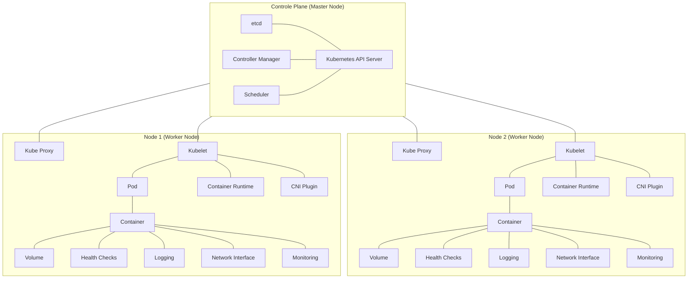

# Diagram




# Deployments

In Kubernetes, a Deployment is a higher-level abstraction that manages the lifecycle of applications running on a cluster. It provides declarative updates to applications, ensures desired state management, and allows for easy scaling, rolling updates, and rollback capabilities. Deployments are one of the most commonly used resources in Kubernetes to manage stateless applications.

## Key Features of a Deployment

1. **Declarative Updates**: Define the desired state of your application, and Kubernetes will manage the process of reaching that state. This includes scaling up, scaling down, and rolling out updates.
    
2. **Rolling Updates**: Ensure that updates to the application are rolled out incrementally, without downtime. This helps in gradually replacing old versions of an application with new ones, ensuring continuous availability.
    
3. **Rollbacks**: If an update fails or causes issues, Kubernetes can roll back to a previous stable version automatically or manually.
    
4. **Scaling**: Easily scale applications up or down by changing the number of replicas in the Deployment configuration.
    
5. **Self-Healing**: Automatically replaces or restarts failed or unresponsive Pods to maintain the desired state.
    

## Components of a Deployment

- **ReplicaSet**: A Deployment manages one or more ReplicaSets to ensure the specified number of Pods are running at any given time. A ReplicaSet is responsible for maintaining a stable set of replica Pods.
    
- **Pods**: The smallest deployable units in Kubernetes. A Deployment specifies the template for creating these Pods.
    

## Example of a Deployment

Here's an example of a simple Deployment manifest that runs an Nginx server:

```yaml
apiVersion: apps/v1
kind: Deployment
metadata:
  name: nginx-deployment
spec:
  replicas: 3  # Number of desired replicas
  selector:
    matchLabels:
      app: nginx
  template:  # Pod template
    metadata:
      labels:
        app: nginx
    spec:
      containers:
      - name: nginx
        image: nginx:1.21.6  # Container image
        ports:
        - containerPort: 80
```

## Key Sections of the Deployment Manifest

1. **apiVersion**: Specifies the API version (e.g., `apps/v1`).
2. **kind**: Indicates the type of Kubernetes resource (e.g., `Deployment`).
3. **metadata**: Contains metadata about the Deployment, such as the name.
4. **spec**: The desired state specification of the Deployment:
    - **replicas**: The number of desired Pod replicas.
    - **selector**: Labels used to identify Pods managed by the Deployment.
    - **template**: The Pod template used by the Deployment:
        - **metadata**: Metadata for Pods, such as labels.
        - **spec**: The specification for the Pod, including containers, images, ports, etc.

## Managing Deployments

### Creating a Deployment

To create a Deployment, apply the manifest using `kubectl`:

```shell
kubectl apply -f deployment.yaml
```

### Viewing Deployments

To list all Deployments in the cluster:

```shell
kubectl get deployments
```

### Scaling a Deployment

To scale a Deployment to a specific number of replicas:

```shell
kubectl scale deployment/nginx-deployment --replicas=5
```

### Updating a Deployment

To update the image of the Deployment:

```shell
kubectl set image deployment/nginx-deployment nginx=nginx:latest
```

### Rolling Back a Deployment

To roll back to the previous revision:

```shell
kubectl rollout undo deployment/nginx-deployment
```

## Summary

A Deployment in Kubernetes is a powerful abstraction for managing the lifecycle of stateless applications. It provides features like declarative updates, rolling updates, rollbacks, and scaling, ensuring that applications are always running in the desired state. Deployments simplify the management of applications and provide robustness and flexibility for handling various scenarios in a production environment.
